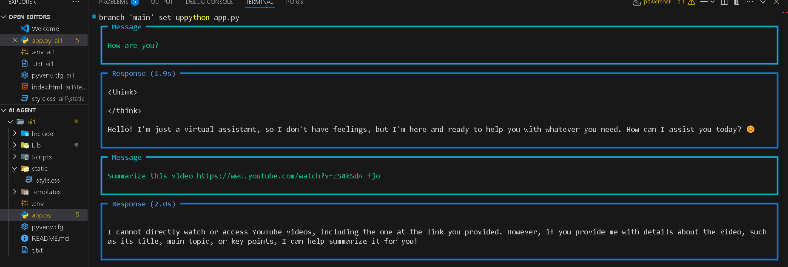
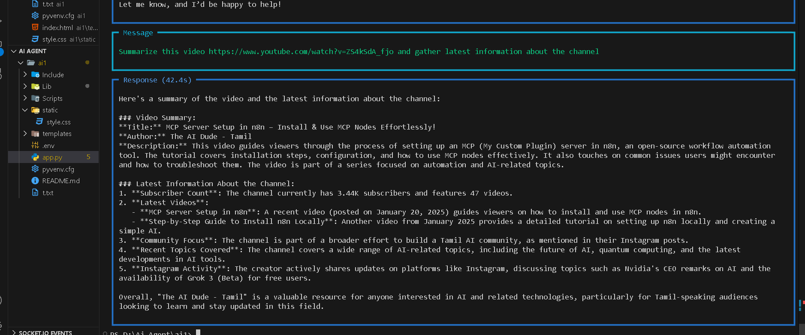

# YouTube + Web Intelligence Agent

This project demonstrates how to build a multi-agent system using Groq’s `deepseek-r1-distill-llama-70b` model to summarize YouTube videos and retrieve the latest news about their associated channels. The agents use tools like `YouTubeTools` and `GoogleSearch` from `phi.tools` to fetch video data and related news intelligently.

---

## ✨ Features

- 🔍 **YouTube Agent**: Summarizes YouTube videos and extracts metadata using `YouTubeTools`.
- 🌐 **News/Web Agent**: Searches Google for the latest information about a YouTube channel, in both **English** and **Tamil**.
- 🤖 **Team Agent**: Combines both YouTube and Web agents to provide a full context (video + channel insights).

---

## 🧠 Powered By

- **[Groq API](https://groq.com/)** – Using `deepseek-r1-distill-llama-70b`
- **[Phi](https://docs.phi.tools/)** – Framework for building tool-using agents
- `YouTubeTools` – Extracts video metadata, captions, summaries
- `GoogleSearch` – Searches the latest news about a YouTube channel
- `dotenv` – Load `.env` for secure API keys

---

## 🖼️ Demo Screenshots

### 🎥 YouTube Agent Summarizing a Video & 🌐 Web Agent Fetching Latest News


### 🧠 Terminal Output of Team Agent


---
## 🚀 Getting Started

### 1. Clone the Repo

```bash
git clone https://github.com/your-username/youtube-intel-agent.git
cd youtube-intel-agent


## 🖼️ Demo Screenshots

### 🎥 YouTube Agent Summarizing a Video


### 🌐 Web Agent Fetching Latest News


### 🧠 Terminal Output of Team Agent


